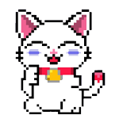

# Furpunks Intro

## Pixel cats with attitude!

Meet the Furpunks.

### Scratching Post

Furpunks is an NFT project similar to CryptoPunks by Larva Labs. This is a personal project that I set out to create in order to teach myself how generative art is made and how to then finally make it available to the public.

I find something refreshing and pleasantly unexpected in the ability to create random pieces of art out of predefined sets of assets. The results were often surprising, somtimes horrifying but always entertaining.

In Jan 2022 I set myself a challenge to learn how to create my own set of NFT art automatically and how the whole process worked from the initial generation of art all the way through to minting and finally making them available for the general public.

During my investigation I found a number of different ways and methods that allowed me to achieve my goal, however, none of them captured all of the steps I ended up taking along the way. This guide aims to do that and hopefully allow someone else who is interested in creating and publishing their own NFTs, to have a single guide that they are able to follow which will walk them through the entire process from beginning to end.

### Inspiration&#x20;

Furpunks are based on the mascot for the memecoin (meowmcoin) Krypto Kitty. You can learn more about Krypto Kitty and their project on their official website: [https://kryptokitty.cc/](https://kryptokitty.cc) and by joining their super friendly community of crypto and cat lovers in their Telegram group: [https://t.me/KryptoKittyTalk](https://t.me/KryptoKittyTalk)

Furpunks and Krypto Kitty are not affiliated in any way other than our love for the memecoin and of course cats!

### Origin Story

One of the first generative art collections built on the blockchain were CryptoPunks. CryptoPunks were created and unleased on to the world by Matt Hall and John Watkinson at Larva Labs in 2017.

Since their inception, CryptoPunks have gone on to inspire countless other NFT projects around the world.&#x20;

## Goal

By the end of this guide you should be able to modify the code to suit your specific requirements and view your NFTs on an NFT marketplace such as Opensea. Other platforms will be added as time goes by so be sure to check back to see if your preferred platform is listed and to view the additional updates.

****

