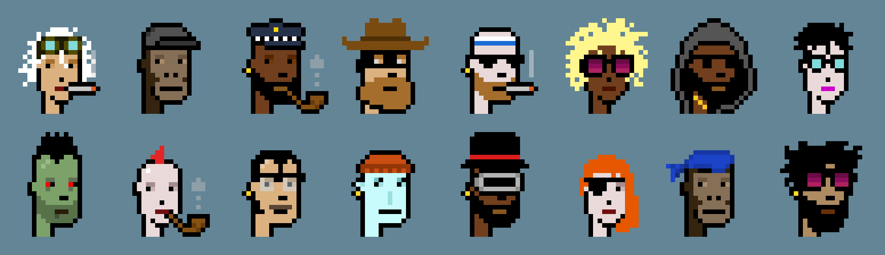

# Furpunks Intro

## Pixel cats with attitude!

Meet the Furpunks.

### Personal note from the creator

I find something refreshing and pleasantly unexpected in the ability to create random pieces of art out of a predefined sets of assets. In Jan 2022 I set myself a challenge to learn how to create my own NFT art automatically and how the whole process worked from the initial generation of art all the way through to sharing it with the public. As a non-programmer, but someone that has hacked / copy pasted my fair share of code, it was also a good way for me to learn more about how the scripting process worked for creating generative NFTs.

During my investigation of how to create generative art I found a number of different methods in which they could be created. Some of the guides were better than others but none of them I felt captured all of the steps I ended up taking. This guide aims to walk anyone interested in creating and publishing their own NFTs through the entire process from beginning to end.&#x20;

Furpunks are based on the mascot for the memecoin (meowmcoin) Krypto Kitty. You can learn more about Krypto Kitty and their project on their official website: [https://kryptokitty.cc/](https://kryptokitty.cc) and by joining their super friendly community of crypto and cat lovers in their Telegram group: [https://t.me/KryptoKittyTalk](https://t.me/KryptoKittyTalk)

Furpunks and Krypto Kitty are not affiliated in any way other than our love for the memecoin and of course cats!

### Origin Story

One of the first generative art collections built on the blockchain were CryptoPunks. CryptoPunks were created and unleased on to the world by Matt Hall and John Watkinson at Larva Labs in 2017.

Since their inception, CryptoPunks have gone on to inspire countless other NFT projects around the world.&#x20;

## Goal

By the end of this guide you should be able to modify the code to suit your specific requirements and view your NFTs on an NFT marketplace such as Opensea. Other platforms will be added as time goes by so be sure to check back to see if your preferred platform is listed and to view the additional updates.

****

